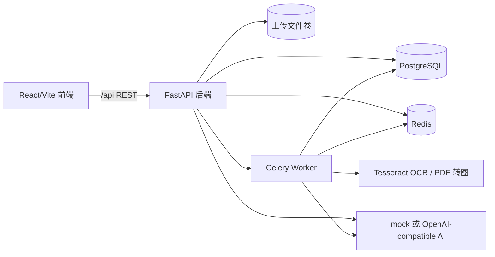

# AI 智能备考复习平台系统实现与系统测试展示报告

| 项目 | 内容 |
| --- | --- |
| 项目名称 | AI 智能备考复习平台 |
| 报告类型 | 系统实现与系统测试展示文档 |
| 后端技术 | FastAPI, SQLAlchemy async, PostgreSQL, Redis, Celery, Alembic |
| 前端技术 | React, TypeScript, Vite |
| AI 能力 | mock AI 或 OpenAI-compatible 模型 |
| 资料处理 | TXT/PDF/图片解析，Tesseract OCR，可选视觉解析增强 |
| 参考结构 | `第1组_系统实现与系统测试报告.docx` 的报告章节方式 |

## 1 引言

### 1.1 编写目的

本文档用于展示 AI 智能备考复习平台的系统实现、功能模块、构建方式和测试覆盖情况。文档在原有分散资料的基础上重新整理，并参考课程测试报告的结构，形成一份可直接用于项目展示、答辩说明和团队交付的 Markdown 报告。

### 1.2 项目背景

平台面向学生备考和课程复习场景，围绕“资料上传、资料解析、知识提炼、知识图谱、AI 问答、AI 出题、自测评分、错题复盘、复习计划”构建完整学习闭环。系统同时提供管理员运维入口，用于用户管理、资料解析任务管理和系统健康检查。

### 1.3 范围说明

本文档覆盖：

1. 前端学生端和管理员端功能。
2. 后端接口、数据流、任务流和 AI/OCR 依赖。
3. 测试分类、测试点和运行方式。
4. 本地开发、Docker 构建、前端打包和部署注意事项。

详细模块文档见：

| 文档 | 内容 |
| --- | --- |
| `docs/frontend.md` | 前端页面、交互、API 调用和注意事项 |
| `docs/backend.md` | 后端架构、接口模块、业务闭环和维护说明 |
| `docs/testing.md` | 自动化测试体系、测试点和运行命令 |
| `docs/build.md` | 构建、部署、环境变量、AI/OCR 配置 |

### 1.4 术语定义

| 术语 | 含义 |
| --- | --- |
| 学习目标 | 一个课程或考试复习空间，承载资料、知识图谱、题目和复习计划 |
| 资料 | 用户上传的 TXT/PDF/图片文件 |
| 解析 | 从资料中提取文本、OCR 内容和结构化章节块 |
| 知识提炼 | 从资料或目标下资料集合中生成摘要、关键词、重点和考点 |
| 知识图谱 | 目标维度下的知识点节点、层级、掌握度和资料证据 |
| 自测 | 基于 AI 生成题目的答题提交和评分过程 |
| 错题本 | 自测后沉淀的错误题目和复做队列 |
| AI 用量 | 平台记录的模型调用、token 和本地费用估算 |

## 2 系统实现概要

### 2.1 总体架构



前端负责用户交互和状态展示，后端负责认证、业务规则、数据持久化、任务调度和 AI/OCR 集成。资料解析和知识刷新类任务可以通过 worker 异步处理，避免长时间阻塞前端请求。

### 2.2 代码结构

```text
app/
  routers/        API 路由
  services/       业务服务
  repositories/   数据访问
  schemas/        Pydantic 模型
  models/         SQLAlchemy 模型
  dependencies/   鉴权依赖
frontend/
  src/App.tsx     单页应用主体
  src/api.ts      API 封装
  src/types.ts    前端类型
tests/            后端测试
docs/             项目文档
```

### 2.3 技术特点

| 方向 | 实现 |
| --- | --- |
| 认证 | JWT Bearer Token，支持学生和管理员角色 |
| 数据隔离 | 所有用户业务数据按 `user_id` 校验归属 |
| 资料解析 | TXT、PDF、图片统一进入 `parse_status` 状态机 |
| 结构化阅读 | sections、chunks、figures、tables、formulas |
| AI 能力 | 问答、知识提炼、图谱、出题、主观题评分、复习计划 |
| 学习反馈 | 错题沉淀、知识点掌握度、错题复做、复习计划 |
| 运维管理 | 管理员总览、用户状态、资料任务、重试、日志 |
| 可观测性 | AI 调用日志、token 统计、解析错误和警告 |

## 3 系统功能实现

### 3.1 用户与权限模块

用户可注册、登录并获取 token。业务接口要求请求头：

```http
Authorization: Bearer <access_token>
```

系统区分学生和管理员：

| 角色 | 能力 |
| --- | --- |
| 学生 | 管理自己的目标、资料、问答、题目、自测、错题、复习计划 |
| 管理员 | 查看全局用户、资料、解析任务、操作日志和健康状态 |

### 3.2 学习目标模块

学习目标是平台的核心空间。一个目标下可包含多份资料、多次知识提炼、多张知识图谱、多组题目、错题和复习计划。

支持能力：

1. 创建课程或考试目标。
2. 更新考试日期、复习目标和描述。
3. 分页查看目标。
4. 删除目标。
5. 获取目标下已解析资料的结构化 chunks。

### 3.3 资料上传与解析模块

资料上传后默认自动解析：

```text
POST /materials
-> 保存资料元数据和源文件
-> parse_status=uploaded
-> 创建解析任务
-> parse_status=parsing
-> worker 执行 TXT/PDF/OCR/视觉解析
-> parse_status=parsed 或 failed
-> 生成结构化内容
-> 触发或支持知识提炼和图谱刷新
```

解析状态：

| 状态 | 说明 |
| --- | --- |
| `uploaded` | 已上传，等待解析 |
| `parsing` | 正在解析 |
| `parsed` | 解析成功，可用于 AI |
| `failed` | 解析失败，查看 `parse_error` |

结构化结果包括章节、文本块、图像说明、表格和公式，既支持资料详情页阅读，也为知识提炼、问答和出题提供更细粒度上下文。

### 3.4 知识提炼与知识图谱模块

系统支持资料级和目标级知识提炼：

| 范围 | 说明 |
| --- | --- |
| 资料级 | 从单份资料中提炼摘要、关键词、重点和考点 |
| 目标级 | 汇总目标下多份已解析资料，生成整体知识结构 |
| 增量刷新 | 结合某份新资料刷新目标图谱 |

知识图谱节点包含：

1. 知识点名称和描述。
2. 层级和父节点。
3. 重要度权重。
4. 掌握状态和掌握分。
5. 答题正确率、错题数量和资料证据。

### 3.5 AI 问答模块

AI 问答支持三类上下文：

| 模式 | 使用场景 |
| --- | --- |
| 资料级问答 | 针对某份资料精确提问 |
| 目标级问答 | 汇总目标下资料进行综合提问 |
| 知识点聚焦问答 | 针对图谱节点和薄弱点提问 |

问答结果会保存到 QA 历史，并返回引用片段和关联知识点，便于用户追溯答案来源。

### 3.6 AI 出题与自测模块

出题支持：

```text
single_choice
multiple_choice
true_false
subjective
```

难度支持：

```text
easy
medium
hard
```

用户提交自测后，系统会：

1. 校验题目归属。
2. 客观题本地评分。
3. 主观题调用 AI 评分。
4. 返回总分、正确率、逐题反馈和知识点表现。
5. 将错误题目沉淀到错题本。
6. 更新知识点掌握度。

题目还支持分级提示、完整解析和围绕某题继续追问。

### 3.7 错题本与复习计划模块

错题本支持按目标、资料、知识点和掌握状态筛选。用户可更新错题掌握状态，也可进入加权复习队列进行错题复做。

复习计划会综合：

1. 知识点掌握度。
2. 错题数量。
3. 答题正确率。
4. 资料证据。
5. 考试日期或用户指定日期范围。

计划任务支持完成状态更新，可作为学习导航入口。

### 3.8 导出与 AI 用量模块

导出能力：

| 内容 | 格式 |
| --- | --- |
| 错题本 | Markdown |
| 复习计划 | Markdown |
| 知识总结 | Markdown |
| Anki 卡片 | CSV |

AI 用量模块记录模型调用次数、token、估算费用和调用明细。费用基于本地配置的单价计算，不代表供应商官方账单。

### 3.9 前端界面实现

前端为单页应用，学生端包含仪表盘、目标、资料、图谱、问答、出题、错题、计划和用量页面。管理员端包含总览、用户、资料、任务、日志和健康页面。

前端重点交互包括：

1. 登录态初始化和 token 持久化。
2. 资料解析状态轮询。
3. 知识作业状态轮询。
4. 源文件 Blob 预览。
5. Markdown/CSV Blob 下载。
6. 学生端和管理员端按角色切换。

## 4 构建与运行

### 4.1 后端启动

```bash
cp .env.example .env
docker compose up --build -d
docker compose exec -T api alembic upgrade heads
```

访问：

```text
http://localhost:8000
http://localhost:8000/docs
```

### 4.2 前端启动

```bash
cd frontend
npm install
npm run dev
```

访问：

```text
http://127.0.0.1:5173
```

### 4.3 前端构建

```bash
cd frontend
npm run build
```

输出目录：

```text
frontend/dist
```

### 4.4 关键配置

| 配置 | 说明 |
| --- | --- |
| `JWT_SECRET_KEY` | 部署必须修改 |
| `AI_PROVIDER` | `mock` 或 `openai-compatible` |
| `AI_API_KEY` | 真实 AI Key，不可提交仓库 |
| `UPLOAD_DIR` | 上传文件目录 |
| `OCR_LANGUAGES` | OCR 语言，默认 `chi_sim+eng` |
| `VISION_ENABLED` | 是否启用视觉解析 |

## 5 测试概要

### 5.1 测试策略

系统测试参考原课程报告的思路，从以下角度组织：

| 测试类型 | 当前落地方式 |
| --- | --- |
| 面向对象/模块测试 | 针对 services、schemas、repositories 和 API 模块的单元/接口测试 |
| 功能验证测试 | 覆盖注册、资料、AI、题目、自测、错题、计划等完整流程 |
| 边界测试 | 覆盖非法输入、分页、权限、文件、日期和状态冲突 |
| 用户界面测试 | 前端构建、页面流程、接口契约和角色界面 |
| 集成测试 | Docker 后端服务级测试 |
| 真实 AI 验收 | 显式开启真实 provider 后运行 |

### 5.2 测试环境

大多数测试使用临时 SQLite 数据库和 FastAPI ASGITransport，不依赖 Docker。集成测试使用 `http://localhost:8000` 的真实服务。真实 AI 测试默认跳过，需设置 `RUN_REAL_AI_ACCEPTANCE=1`。

## 6 面向对象和模块测试

| 模块 | 覆盖测试 |
| --- | --- |
| 认证和用户 | 注册登录、JWT、停用用户、管理员权限 |
| 学习目标 | CRUD、分页、跨用户隔离 |
| 资料服务 | 上传、解析、预览、删除、失败记录 |
| 解析服务 | OCR、视觉解析折叠、结构化块分类 |
| 知识服务 | 提炼范围、最新结果、关键词清洗 |
| 图谱服务 | 节点生成、增量合并、循环拒绝、证据链接 |
| 问答服务 | 资料级、目标级、知识点聚焦、历史 |
| 出题服务 | 范围、题型、难度、提示、解析 |
| 自测服务 | 评分、主观题反馈、知识点汇总 |
| 错题服务 | 沉淀、筛选、复做、掌握状态 |
| 复习计划服务 | 日期范围、任务引用、完成状态 |
| AI 用量服务 | token 价格和日志统计 |

## 7 功能验证测试

| 功能链路 | 验证内容 | 结果要求 |
| --- | --- | --- |
| 注册登录 | 创建账号、登录、获取当前用户 | 返回 token 和用户信息 |
| 创建目标 | 新建考试/课程目标 | 返回目标详情 |
| 上传资料 | 上传 TXT/PDF/图片 | 返回资料元数据和解析状态 |
| 资料解析 | 自动或手动解析 | 最终 `parsed` 或记录 `failed` 原因 |
| 结构化阅读 | 章节、文本块、图表公式 | 返回结构化结果 |
| 知识提炼 | 资料级和目标级提炼 | 返回摘要、关键词、重点、考点 |
| 知识图谱 | 生成或刷新图谱 | 返回节点、关系、掌握度 |
| AI 问答 | 按资料/目标/知识点提问 | 返回答案、引用和知识点 |
| AI 出题 | 生成多题型题目 | 返回题干、选项、难度和知识点 |
| 自测提交 | 提交客观题和主观题 | 返回分数、反馈和知识点表现 |
| 错题本 | 查看、筛选、复做错题 | 状态可更新，复做可评分 |
| 复习计划 | 生成计划并更新任务 | 任务可完成/取消完成 |
| 导出 | 导出 Markdown/CSV | 返回文件内容 |
| 管理后台 | 用户、资料、任务、日志 | 管理员可访问，学生不可访问 |

## 8 边界测试

| 类型 | 示例 |
| --- | --- |
| 认证边界 | 未登录、错误 token、过期 token、错误认证 scheme |
| 输入边界 | 空用户名、空密码、超长用户名、空标题 |
| 枚举边界 | 非法目标类型、题型、难度、掌握状态 |
| 文件边界 | 空文件、缺失文件、超大文件、不支持文件类型 |
| 权限边界 | 跨用户访问目标、资料、错题、题目 |
| 状态边界 | 未解析资料调用 AI、自测使用不存在题目 |
| 日期边界 | 复习计划结束日期早于开始日期 |
| 分页边界 | `page < 1`、`page_size` 超限 |
| 管理员边界 | 学生访问 `/admin/*` 被拒绝 |

## 9 用户界面测试

前端界面测试重点：

1. 未登录时只显示登录/注册入口。
2. 学生登录后展示完整学习工作台。
3. 管理员登录后展示后台管理入口。
4. 资料上传后页面能展示解析状态并自动轮询。
5. `parsed` 资料可以进入问答、出题和图谱流程。
6. `failed` 资料显示失败原因并提供重试。
7. 源文件预览通过 Blob URL 正常展示 PDF、图片或文本。
8. Markdown/CSV 导出可以触发下载。
9. 前端构建 `npm run build` 通过 TypeScript 和 Vite 检查。

## 10 测试运行方式

后端主测试：

```bash
python -m pytest
```

Docker 内运行：

```bash
docker compose exec -T api python -m pytest
```

前端构建验证：

```bash
cd frontend
npm run build
```

真实 AI 验收：

```bash
RUN_REAL_AI_ACCEPTANCE=1 \
AI_PROVIDER=openai-compatible \
AI_API_KEY=your_key \
AI_BASE_URL=https://example.com/v1 \
AI_MODEL=your_model \
python -m pytest tests/test_real_ai_provider_smoke.py tests/test_real_ai_acceptance.py
```

## 11 测试结论与建议

### 11.1 结论

当前系统已形成完整 AI 学习闭环，并具备较完整的后端自动化测试覆盖。测试覆盖了认证、权限、资料解析、知识提炼、知识图谱、AI 问答、AI 出题、自测评分、错题复做、复习计划、导出、AI 用量和管理员运维等核心能力。

前端已实现学生端和管理员端主要页面，并通过统一 API 层对接后端。构建命令会执行 TypeScript 检查和 Vite 打包，可作为前端基础验收手段。

### 11.2 已知边界

1. 真实 AI 能力依赖 `.env` 中的外部供应商配置。
2. 视觉解析默认关闭，启用后需要额外模型 Key 和网络。
3. OCR 对扫描质量敏感，低质量资料可能返回 `parse_warning`。
4. 前端保留 `GET /tests/records` 调用，但当前后端未暴露该接口。
5. 管理员后台已有基础能力，后续可继续增强筛选、统计和批量操作。

### 11.3 后续建议

1. 补齐自测记录列表后端接口，和前端 `listTestRecords()` 对齐。
2. 为前端增加组件级或端到端测试，提高 UI 回归稳定性。
3. 对真实 AI 的结构化输出增加更多容错和质量评估。
4. 将知识图谱和复习计划的效果指标纳入长期评估。
5. 为生产部署补充 HTTPS、CORS、日志采集和备份策略。

## 12 文档索引

| 文档 | 用途 |
| --- | --- |
| `docs/frontend.md` | 前端开发和联调 |
| `docs/backend.md` | 后端接口和架构说明 |
| `docs/testing.md` | 测试执行和测试点说明 |
| `docs/build.md` | 构建、部署和环境配置 |
| `docs/system-implementation-and-test-report.md` | 最终展示报告 |
